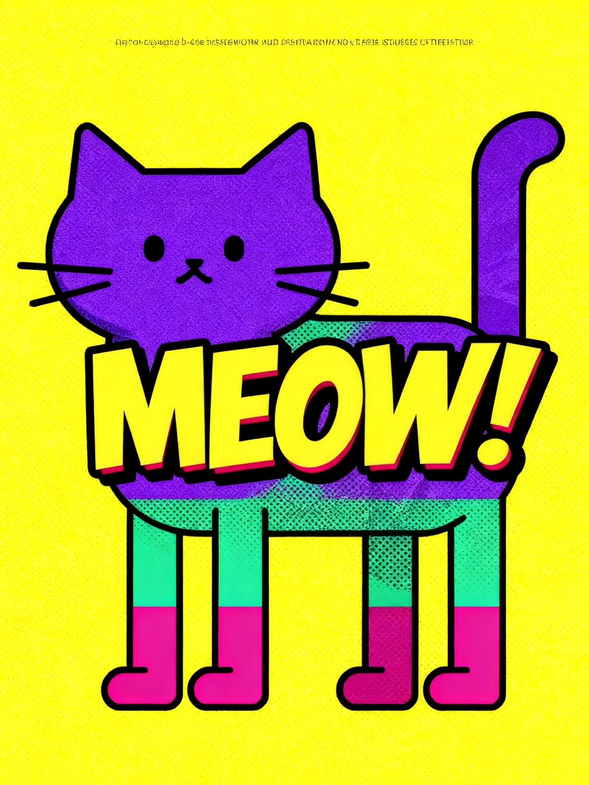

# PPT-Design-DNA

> 从参考图到 Design Profile，再到高质量 HTML PPT。

[English](#english-version) | 中文为主，关键术语保留英文

PPT-Design-DNA 是一个 **Design DNA 驱动的 HTML PPT 生成 Skill**：它可以从参考图中提取视觉系统，沉淀成可复用的 **Design Profile**，再把这种风格稳定迁移到真实演示文稿里。

它不是模板填充器，而是一个面向 PPT 的 **AI 视觉系统设计师**。我的目标很简单：别再让 PPT 像随机抽卡一样靠运气出图了。把“我喜欢这个画面感觉”变成可复用、可调参、可适配场景的设计资产。

```text
参考图 / Style Source
        ↓
Design DNA / Design Profile
        ↓
生成的 HTML PPT / Generated Deck
```

## 效果预览

参考图只用于 **风格提取**，不会默认被塞进 PPT 内容页。项目真正迁移的是视觉语言：颜色、构图、字体气质、纹理、留白、节奏、动效倾向和“不该怎么做”的负约束。

### Demo 1：Pop Comic 咨询报告

酸黄背景、粗黑描边、洋红/青色块、网点纹理和像素装饰，被迁移到一份商业咨询报告里。参考图里的“好玩”没有被照搬成贴纸，而是变成了 PPT 的信息层级和版式性格。

<table>
  <tr>
    <th width="34%">参考图 / Style Source</th>
    <th width="66%">生成的 HTML PPT / Generated Deck</th>
  </tr>
  <tr>
    <td>
      
    </td>
    <td>
      
      
    </td>
  </tr>
</table>

### Demo 2：Blue Sketch × Bubble Type

这一组使用多张参考图混合出一个 Design DNA：蓝白黑手绘线条、绿色气泡字体、颗粒质感、粗标题和卡片节奏被融合到同一套 deck 里。重点不是复制角色或文字，而是抽取“这套视觉为什么成立”。

<table>
  <tr>
    <th width="34%">参考图 / Style Source</th>
    <th width="66%">生成的 HTML PPT / Generated Deck</th>
  </tr>
  <tr>
    <td>
      
      
    </td>
    <td>
      
      
      
    </td>
  </tr>
</table>

## 这个项目解决什么

很多 AI PPT 工具的问题不是“不够会排版”，而是没有稳定的视觉系统。一次生成很好看，下一次就像换了一个设计师；一页很有气质，下一页又突然开始库存模板味。

PPT-Design-DNA 试图把这件事拆开：

- 先从参考图里提取 **Design DNA**，而不是只抄颜色和字体。
- 再把它保存成 **Design Profile**，让风格可以复用、调参、版本化。
- 然后根据具体演讲场景生成 **Design Adapter**，避免“漂亮但不适合汇报”的尴尬。
- 最后用 **Design Contract -> PPT Blueprint -> Page Specs -> HTML Deck** 的链路生成页面，少一点玄学，多一点可控。

换句话说，它关心的不只是“这一页好不好看”，而是“这套 PPT 有没有自己的视觉规则”。

## 核心亮点

### 1. 任意参考图都可以成为风格来源

参考图不必是 PPT。它可以是海报、网页、杂志、游戏截图、插画、UI、品牌视觉、摄影作品，甚至是一张你觉得“这个味儿对了”的图。

项目会把参考图拆成多层设计信号：

- **Mood**：情绪、气质、能量水平。
- **Composition**：构图、留白、视线动线、信息密度。
- **Visual**：颜色、字体倾向、纹理、图形语言、材质感。
- **Content Strategy**：适合承载什么类型的信息，不适合什么内容。
- **Presentation**：页面节奏、动效倾向、章节感和演示方式。

### 2. Design Profile：风格不是一次性 prompt

Design Profile 是这个项目里最重要的资产。它记录的不只是“请做成某某风格”，而是一套可以复用的设计系统：

- 风格身份和来源摘要。
- 当前版本的 Design DNA 快照。
- 设计 tokens、负约束和适用场景。
- 可选的版本历史、Design Diff 和导出提示词。

这样做的好处是：同一种风格可以被保存、复用、微调、比较，也可以在不同主题和不同受众之间迁移。PPT 不再是一次性生成物，而是有“设计记忆”的。

### 3. Design Adapter：同一套风格，不同场景要会变形

一套视觉风格不可能无脑套所有场景。发布会可以更张扬，咨询汇报需要更清楚，课程分享要更耐读，作品集又需要更有个人表达。

Design Adapter 用来处理这种冲突：

- **Visual first**：优先保留视觉冲击力，压缩内容。
- **Dynamic downgrade**：降低一点表现性，换取更高信息密度和可读性。
- **Cell division**：保持美感，把复杂内容拆到更多页里。

这也是我很在意的一点：好看的 PPT 不应该靠牺牲表达来换。真正有用的系统，要知道什么时候该克制，什么时候该炸场。

### 4. HTML-first：先生成可检查的演示文稿

项目的主输出是 HTML deck，而不是一上来就把所有东西压进 PPTX。

HTML-first 的优势很直接：

- 固定 16:9 stage，适合统一视觉和演示尺寸。
- 可以做更稳定的动画、转场和交互。
- 方便在浏览器里检查布局、层级、动效和溢出。
- 后续可以按需求导出 PDF 或 PPTX。

我更愿意把 HTML 当作视觉源文件：它可读、可查、可调，也更适合承载复杂的版式和动效。

### 5. 视觉安全规则：少一点翻车现场

项目内置了一组视觉安全要求，用来拦截常见的 AI PPT 事故：

- 空白图片框和尴尬占位符。
- 低对比文字、白字压浅底。
- 装饰图层盖住正文。
- 导航控件遮挡页面内容。
- 卡片、标题、正文挤在一起。
- 同一种布局硬塞过量内容。

这部分听起来不浪漫，但很重要。设计不是只负责惊艳三秒，也要负责让观众真的看清楚。

## 工作流

PPT-Design-DNA 的完整链路如下：

```text
选择设计来源
  -> 提取或发现 Design DNA
  -> 展示 Design DNA 参数面板
  -> 用户确认或调参
  -> 保存 / 更新 Design Profile
  -> 收集 PPT 主题、受众、页数、内容密度和叙事方式
  -> 检查设计与场景是否冲突
  -> 必要时创建 Design Adapter
  -> 生成 Design Contract
  -> 规划 PPT Blueprint
  -> 生成每页 Page Specs
  -> 输出固定舞台的 HTML Deck
  -> 可选导出 PDF / PPTX
```

这个顺序故意设计得比较严格。先定风格，再定内容；先有规则，再生成页面。否则很容易变成“一个 prompt 冲到底”，最后漂亮靠运气，修改靠祈祷 🙏。

## 30 秒开始

### 1. 安装这个 Skill

把仓库作为 Codex Skill 安装到本地 skills 目录。安装完成后，使用时直接点名 `PPT-Design-DNA`，或者描述“我要根据参考图生成一套 PPT 风格”。

### 2. 准备参考图

可以给一张图，也可以给多张图。多张图默认会被融合成一套风格；如果你想分开保存成多个 profile，也可以明确说明。

### 3. 先确认 Design DNA，再生成 PPT

项目会先展示 Design DNA 参数面板。确认或调参后，它会保存 Design Profile，再进入 PPT 需求收集和生成阶段。

### 4. 输出 HTML Deck

默认输出 HTML 演示文稿。需要 PDF 或 PPTX 时，可以在最后要求导出。

## Prompt 示例

### 从参考图生成新风格

```text
使用 PPT-Design-DNA。
我会给你 2 张参考图，请先提取 Design DNA，不要直接生成 PPT。
我想把它保存成一个可复用的 Design Profile，后续用来做产品发布会风格的 HTML PPT。
```

### 复用已有 Design Profile

```text
使用 PPT-Design-DNA。
请从我保存过的 Design Profile 里选择「Pop Comic Consulting」这套风格。
主题是 AI Agent 竞争格局咨询报告，8 页，受众是企业管理层。
优先保持强视觉冲击，但正文必须清楚可读。
```

### 把风格适配到更正式的汇报

```text
使用 PPT-Design-DNA。
沿用上次的 Blue Sketch × Bubble Type 风格，但这次是内部战略复盘。
请创建一个更正式、更高信息密度的 Design Adapter。
如果原风格和汇报场景冲突，优先保留识别度，其次提高可读性。
```

## 适合谁

这个项目特别适合这些场景：

- 想做创意风格迁移型 PPT，而不是套模板。
- 要做商业咨询、策略汇报、产品发布、课程分享或作品集展示。
- 团队希望沉淀一套可复用的视觉系统。
- 看到一张图时，脑子里会冒出一句：“这个风格能不能拿来做 PPT？”
- 不满足于“生成一份 PPT”，而是想建立自己的演示文稿设计资产。

## 项目结构

```text
PPT-Design-DNA/
├─ SKILL.md              # Skill 主入口和完整工作流
├─ agents/
│  └─ openai.yaml        # Agent 配置
├─ references/           # Design DNA、Profile、Adapter、HTML 生成和视觉安全规则
└─ 演示截图/             # README 中使用的效果展示图片
```

几个关键文件：

- `SKILL.md`：项目主说明，定义整体链路、交互门槛和生成原则。
- `references/design-dna-schema.md`：Design DNA 的结构定义。
- `references/profile-management.md`：Design Profile 的保存、版本和复用规则。
- `references/design-adapter.md`：场景适配和风格变体规则。
- `references/html-generation-rules.md`：HTML deck 生成规则。
- `references/visual-safety-rules.md`：视觉安全和排版防翻车规则。

## 设计原则

### 不把参考图当素材库

参考图是风格证据，不是默认内容素材。除非用户明确说明某张图要出现在页面里，否则它只用于提取视觉系统。

### 不把 Design DNA 简化成配色表

颜色和字体只是最表层的东西。真正决定风格的，还有构图、节奏、密度、材质、动效、语气和负空间。

### 不从一个松散 prompt 直接生成整套 PPT

项目会先规划，再生成。Deck Blueprint 和 Page Specs 的存在，就是为了让每一页都知道自己为什么存在、承载什么信息、使用什么版式，以及不能犯什么错。

### 不追求永远“最炫”

有些场景需要炸场，有些场景需要克制。Design Adapter 的意义，就是让风格服务表达，而不是反过来绑架内容。

## 当前版本

当前版本：**V3 - Design Adapter and Discovery**

V3 包含：

- 从参考图提取 Design DNA。
- 无参考图时进行 Design Discovery。
- Design Profile 复用、版本化和 Design Diff。
- Design Adapter 场景变体。
- Image Asset Strategy，区分参考图和内容图。
- 更强的视觉安全约束。
- HTML-first deck 生成，可选 PDF / PPTX 导出。

## English Version

**PPT-Design-DNA** is a Design-DNA-driven skill for creating HTML-first presentation decks.

It turns visual references into reusable **Design Profiles**, then applies those profiles to real presentation scenarios through structured planning and generation. The goal is not to fill templates, but to build a reusable visual system for decks.

Core workflow:

```text
Style source
  -> Design DNA
  -> Design Profile
  -> Scenario requirements
  -> optional Design Adapter
  -> Design Contract
  -> PPT Blueprint
  -> Page Specs
  -> HTML Deck
```

Why it matters:

- A reference image becomes a reusable design asset, not a one-off prompt.
- Design Profiles can be saved, tuned, versioned, and reused.
- Design Adapters help the same style fit different scenarios such as consulting reports, launches, courses, and portfolios.
- HTML-first output makes layout, motion, and visual quality easier to inspect.
- Visual safety rules reduce common deck failures such as low contrast, empty placeholders, text collisions, and decorative layers covering content.

The demos above show the intended reading path: **style source -> extracted visual language -> generated presentation pages**. The reference images are used for style extraction only; they are not automatically inserted as slide content.
