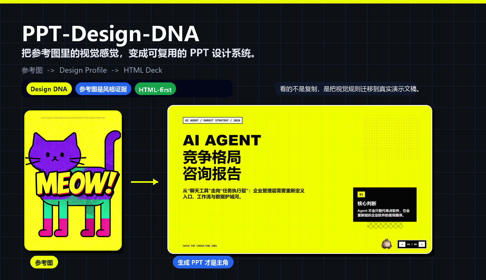
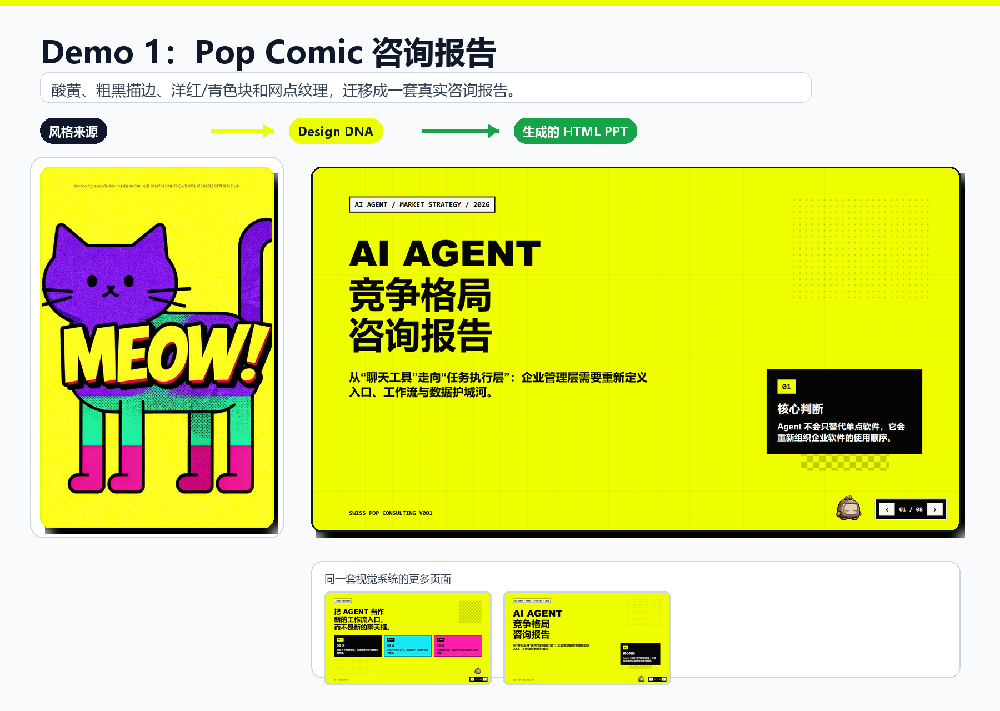
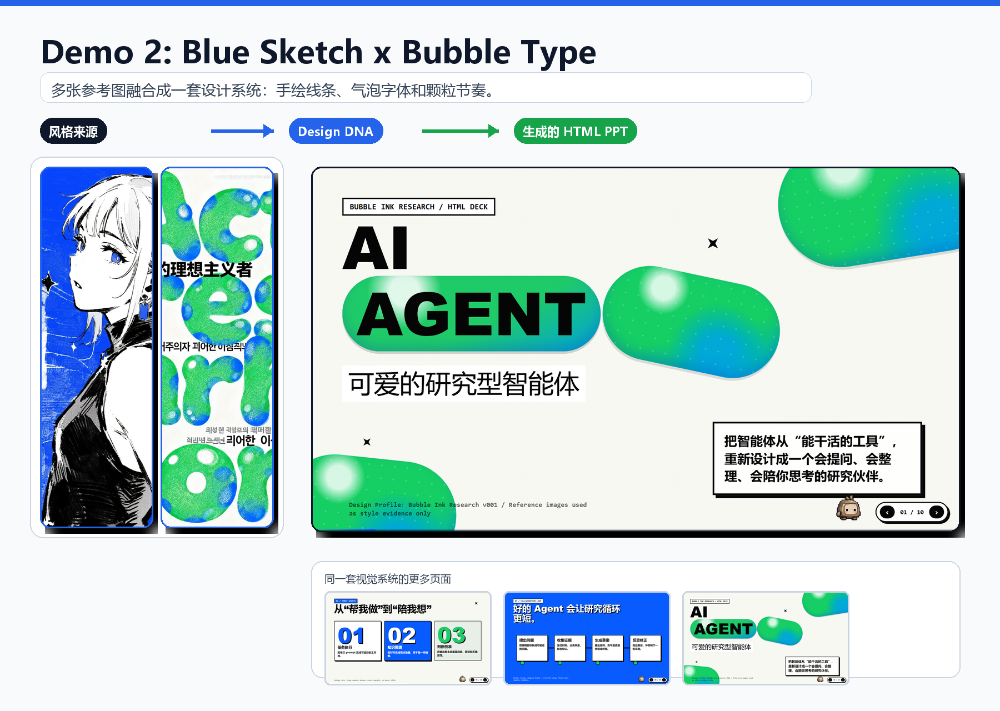

# PPT-Design-DNA

> 把参考图里的“视觉感觉”，变成可复用的 PPT 设计系统。

🌐 English version: [README_en.md](README_en.md)

PPT-Design-DNA 是一个 **Design DNA 驱动的 HTML PPT 生成 Skill**。它不是模板填充器，也不是“换个配色再排版”的普通 AI PPT 流程。它做的是：从参考图里提取视觉系统，保存成可复用的 **Design Profile**，再把这套风格稳定迁移到真实演示文稿里。

🧬 **Design DNA 驱动**：抽取情绪、构图、字体气质、纹理、密度和动效倾向  
🎨 **参考图是风格证据**：参考图默认不进入 PPT，只用来提取视觉规则  
🚀 **HTML-first 输出**：先生成可检查、可演示、可导出的高质量 HTML Deck



## 🎨 效果预览

阅读这组图的方式很简单：

```text
Style Source -> Design DNA / Design Profile -> Generated HTML PPT
```

重点不是“把参考图复制进 PPT”，而是把它背后的视觉语言拆出来：颜色、节奏、字体气质、留白、纹理、信息密度、视觉安全边界，以及那些“不该这么做”的负约束。

### Demo 1：Pop Comic 咨询报告

酸黄背景、粗黑描边、洋红/青色块、网点纹理和像素装饰，被迁移到一份 AI Agent 咨询报告里。参考图里的“好玩”没有变成贴纸，而是变成了 PPT 的信息层级和版式性格。



原始截图： [参考图](<演示截图/1/参考图.webp>) / [生成页 1](<演示截图/1/生成的ppt (2).png>) / [生成页 2](<演示截图/1/生成的ppt (1).png>)

### Demo 2：Blue Sketch × Bubble Type

这一组使用多张参考图混合出一个 Design DNA：蓝白黑手绘线条、绿色气泡字体、颗粒质感、粗标题和卡片节奏被融合到同一套 deck 里。重点不是复制角色或文字，而是抽取“这套视觉为什么成立”。



原始截图： [参考图 1](<演示截图/2/参考图 (1).webp>) / [参考图 2](<演示截图/2/参考图 (2).webp>) / [生成页 1](<演示截图/2/生成的ppt (1).png>) / [生成页 2](<演示截图/2/生成的ppt (2).png>) / [生成页 3](<演示截图/2/生成的ppt (3).png>)

## 🧬 它到底在做什么

很多 AI PPT 工具的问题不是“不够会排版”，而是没有稳定的视觉系统。一页好看，下一页像换了设计师；这次有气质，下次又突然变成库存模板。PPT-Design-DNA 想解决的是这件事：把一次性的“好看结果”，变成可以复用、可以调参、可以适配场景的设计资产。

项目把 PPT 生成拆成一条更可控的链路：

```text
参考图 / 已保存 Profile / 无图 Design Discovery
  -> Design DNA
  -> 参数面板与调参
  -> Design Profile
  -> PPT 需求
  -> Design Adapter
  -> Design Contract
  -> PPT Blueprint
  -> Page Specs
  -> HTML Deck
```

换句话说，它关心的不只是“这一页好不好看”，而是“这套 PPT 有没有自己的视觉规则”。如果一套 deck 能稳定表达同一种气质、同一种信息密度、同一种动效节奏，它才真正像一个被设计过的演示文稿。

## ✨ 核心能力

| 能力 | 说明 |
| --- | --- |
| 🧬 Design DNA | 不只提取配色和字体，而是抽取 Mood、Composition、Visual、Content Strategy、Presentation 五层视觉系统 |
| 🎛️ 参数面板 | 先展示可调参数，再生成 PPT，避免一个 prompt 冲到底 |
| 🗂️ Design Profile | 把风格保存成可复用资产，支持复用、调参、版本化和 Design Diff |
| 🧩 Design Adapter | 同一套风格可以适配咨询汇报、发布会、课程分享、作品集等不同场景 |
| 🖼️ Image Asset Strategy | 明确区分“参考图”和“内容图”，避免把风格图误塞进页面 |
| 🚀 HTML-first | 固定 16:9 stage，适合动画、检查、浏览器演示和后续导出 |
| 🛡️ 视觉安全规则 | 避免低对比、空占位、文字被装饰挡住、导航盖住内容等常见翻车现场 |

## 🏗️ 核心机制

### Design DNA：不只是颜色和字体

Design DNA 会从五个层面描述一套风格：

- **Mood**：情绪、能量、温度、视觉态度。
- **Composition**：构图、留白、对齐、节奏、页面密度。
- **Visual**：颜色、字体倾向、描边、纹理、图形语言。
- **Content Strategy**：适合承载什么内容，不适合承载什么内容。
- **Presentation**：章节节奏、动效方向、页面切换和演示氛围。

这也是为什么参考图可以不是 PPT。海报、网页、插画、杂志、UI、游戏截图都可以成为风格来源。项目要提取的不是图片本身，而是它背后的视觉规则。

### Design Profile：风格不是一次性 prompt

Design Profile 是这个项目里最重要的资产。它记录风格身份、来源摘要、Design DNA 快照、设计 tokens、适用场景、负约束和当前版本。后续同一套风格可以继续复用，也可以调参生成新版本。

这让 PPT 生成从“这次运气不错”变成“这套风格可以长期维护”。如果你喜欢某个视觉方向，不需要每次重新描述一遍，也不用祈祷模型记得上次的感觉。

### Design Adapter：好看的风格也要适配场景

一套视觉风格不可能无脑套所有场景。发布会可以更张扬，咨询汇报需要更清楚，培训课件要更耐读，作品集又需要更有个人表达。

Design Adapter 用来处理这种冲突：

- **Visual first**：优先保留视觉冲击力，压缩内容。
- **Dynamic downgrade**：降低一点表现性，换取更高信息密度和可读性。
- **Cell division**：保持美感，把复杂内容拆到更多页里。

好看的 PPT 不应该靠牺牲表达来换。真正有用的视觉系统，要知道什么时候该克制，什么时候该炸场。

### Blueprint 和 Page Specs：先规划，再生成

项目不会从一个松散 prompt 直接生成整套 PPT。它会先规划 deck 的叙事结构，再为每一页生成 Page Specs。每页都需要知道：这一页的目的是什么、核心信息是什么、应该用什么布局、能承载多少文字、哪些元素不能互相遮挡。

这种“先设计规则，再生成页面”的方式，比直接让模型自由发挥更稳定，也更容易调试。

## 🖼️ 关于参考图和内容图

参考图默认只用于风格提取。它不是素材库，也不是默认会被放进 PPT 里的图片。

如果你希望某张图片真的出现在页面里，需要把它作为 **内容图** 明确说明。比如产品照片、团队合影、流程图、系统架构图、业务截图，这些会进入 Image Asset Strategy；而风格参考图只负责告诉系统“这套设计应该是什么气质”。

这个区分很重要。否则很容易出现两种问题：要么参考图被生硬贴进页面，要么真正需要展示的内容图片没有被纳入版式规划。

## 🚀 30 秒开始

### 1. 安装 Skill

把仓库作为 Codex Skill 安装到本地 skills 目录。使用时可以直接点名 `PPT-Design-DNA`，也可以直接说“做 PPT / 生成 PPT / 美化 PPT / 做汇报”，或者描述“我要根据参考图生成一套 PPT 风格”。

### 2. 提供设计来源

可以给一张参考图，也可以给多张参考图。多张图默认会被融合成一套风格；如果要分开保存成多个 profile，可以明确说明。没有参考图时，也可以进入 Design Discovery，让项目根据描述生成候选视觉方向。

### 3. 确认 Design DNA

项目会先展示 Design DNA 参数面板。你可以直接接受，也可以调整颜色强度、信息密度、动效节奏、页面留白、风格风险等参数。确认后，这套 Design DNA 会作为本次 PPT 的 active candidate 使用；只有你明确选择保存时，才会保存为可复用 Design Profile。

### 4. 补充 PPT 需求

确认 active Design DNA 后，再提供主题、受众、页数、内容来源、叙事方式、输出格式和图片策略。这个顺序是刻意设计的：先确定视觉系统，再让内容进入正确的设计框架。保存 Profile 是可选步骤，不会默认发生。

### 5. 生成 HTML Deck

默认输出 HTML 演示文稿。需要 PDF 或 PPTX 时，可以在最后要求导出。HTML 是主要视觉源文件，方便检查布局、动效、层级和溢出。

## 🧪 Prompt 示例

### 从参考图生成新风格

```text
使用 PPT-Design-DNA。
我会给你 2 张参考图，请先提取 Design DNA，不要直接生成 PPT。
我想把它保存成一个可复用的 Design Profile，后续用来做产品发布会风格的 HTML PPT。
```

### 复用已有 Design Profile

```text
使用 PPT-Design-DNA。
请从我保存过的 Design Profile 里选择「Pop Comic Consulting」这套风格。
主题是 AI Agent 竞争格局咨询报告，8 页，受众是企业管理层。
优先保持强视觉冲击，但正文必须清楚可读。
```

### 把风格适配到更正式的汇报

```text
使用 PPT-Design-DNA。
沿用上次的 Blue Sketch × Bubble Type 风格，但这次是内部战略复盘。
请创建一个更正式、更高信息密度的 Design Adapter。
如果原风格和汇报场景冲突，优先保留识别度，其次提高可读性。
```

### 无参考图时做 Design Discovery

```text
使用 PPT-Design-DNA。
我没有参考图，但想做一套「克制、锋利、有一点未来感」的行业研究分享。
请先做 Design Discovery，给我 3 个候选视觉方向，不要直接生成 PPT。
```

## 🧭 适合谁

- 想做创意风格迁移型 PPT，而不是继续套模板。
- 要做商业咨询、策略汇报、产品发布、课程分享或作品集展示。
- 团队希望沉淀一套可复用的视觉系统。
- 看到一张图时，脑子里会冒出一句：“这个风格能不能拿来做 PPT？”
- 不满足于“生成一份 PPT”，而是想建立自己的演示文稿设计资产。

## 📁 项目结构

```text
PPT-Design-DNA/
├─ SKILL.md              # Skill 主入口和完整工作流
├─ agents/
│  └─ openai.yaml        # Agent 配置
├─ references/           # Design DNA、Profile、Adapter、HTML 生成和视觉安全规则
├─ assets/readme/        # README 专用预览图
└─ 演示截图/             # Demo 原始截图
```

几个关键文件：

- `SKILL.md`：项目主说明，定义整体链路、交互门槛和生成原则。
- `references/design-dna-schema.md`：Design DNA 的结构定义。
- `references/profile-management.md`：Design Profile 的保存、版本和复用规则。
- `references/design-adapter.md`：场景适配和风格变体规则。
- `references/html-generation-rules.md`：HTML Deck 生成规则。
- `references/visual-safety-rules.md`：视觉安全和排版防翻车规则。

## 📌 当前版本

当前版本：**V3 - Design Adapter and Discovery**

V3 包含：

- 从参考图提取 Design DNA。
- 无参考图时进行 Design Discovery。
- Design Profile 复用、版本化和 Design Diff。
- Design Adapter 场景变体。
- Image Asset Strategy，区分参考图和内容图。
- 更强的视觉安全约束。
- HTML-first deck 生成，可选 PDF / PPTX 导出。

## 📜 License

本项目基于 [Apache License 2.0](LICENSE) 开源。

你可以自由使用、修改和分发这个项目，包括用于商业场景；使用时请保留原作者版权声明和许可证信息。
