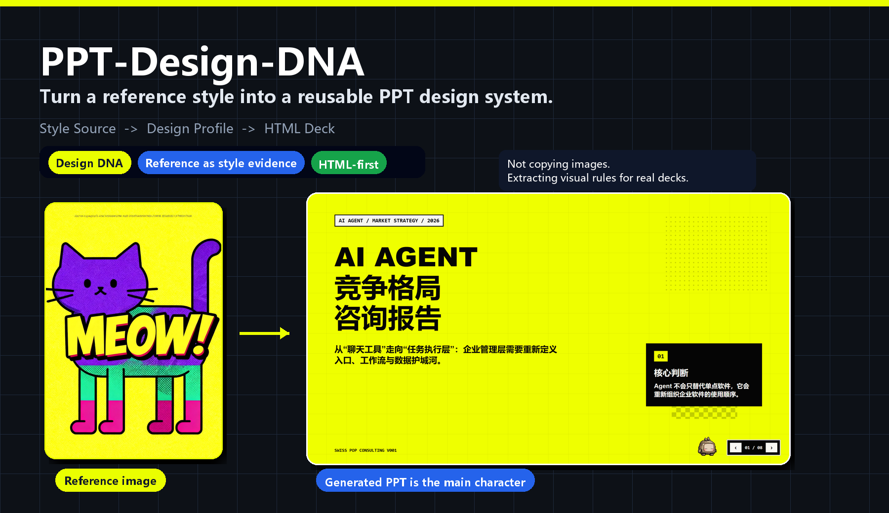
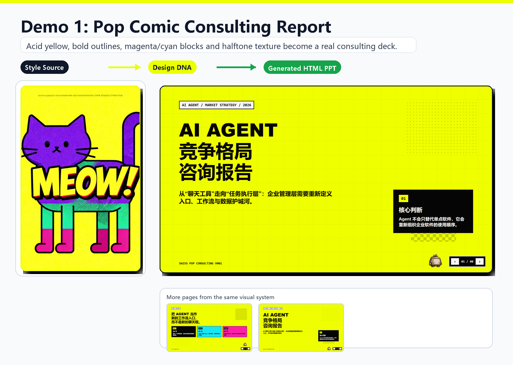
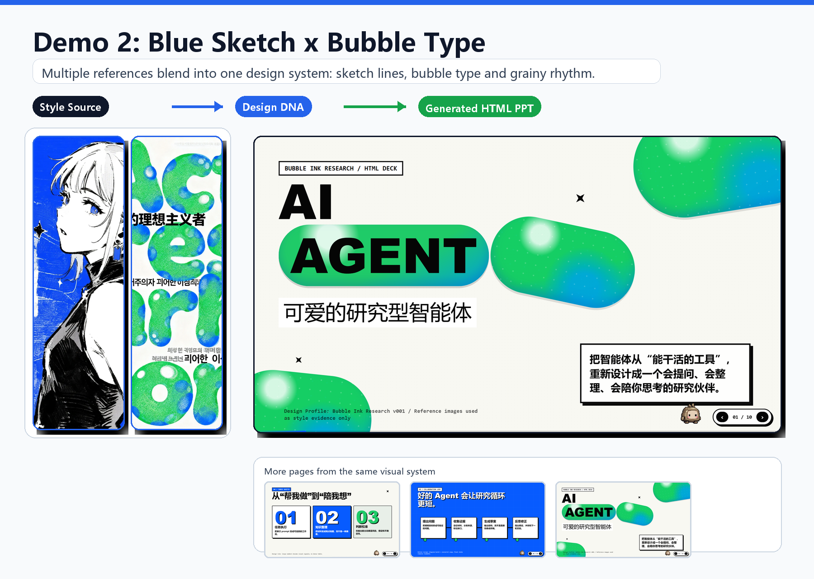

# PPT-Design-DNA

> Turn the visual feeling of a reference image into a reusable PPT design system.

中文版本: [README.md](README.md)

PPT-Design-DNA is a **Design-DNA-driven skill for HTML-first presentation decks**. It is not a template filler, and it is not just a color-swap workflow. It extracts a visual system from reference images, saves it as a reusable **Design Profile**, and applies that style to real presentation decks.

🧬 **Design DNA driven**: mood, composition, typography, texture, density, motion, and constraints  
🎨 **Reference as style evidence**: reference images are not inserted into slides by default  
🚀 **HTML-first output**: generate inspectable, presentable, exportable HTML decks



## 🎨 Demos

The intended reading path is:

```text
Style Source -> Design DNA / Design Profile -> Generated HTML PPT
```

The goal is not to copy the reference image into the deck. The goal is to extract the visual language behind it: color, rhythm, typography, spacing, texture, information density, motion direction, and negative constraints.

### Demo 1: Pop Comic Consulting Report

Acid yellow, bold outlines, magenta/cyan blocks, halftone texture, and pixel details become a real AI Agent consulting deck.



Original screenshots: [reference](<演示截图/1/参考图.webp>) / [generated page 1](<演示截图/1/生成的ppt (2).png>) / [generated page 2](<演示截图/1/生成的ppt (1).png>)

### Demo 2: Blue Sketch × Bubble Type

Multiple references blend into one Design DNA: blue/white/black sketch lines, green bubble type, grainy texture, bold titles, and card rhythm.



Original screenshots: [reference 1](<演示截图/2/参考图 (1).webp>) / [reference 2](<演示截图/2/参考图 (2).webp>) / [generated page 1](<演示截图/2/生成的ppt (1).png>) / [generated page 2](<演示截图/2/生成的ppt (2).png>) / [generated page 3](<演示截图/2/生成的ppt (3).png>)

## 🧬 What It Does

Many AI PPT tools fail because they do not maintain a stable visual system. One slide looks good, and the next slide feels like it was made by another designer. PPT-Design-DNA tries to turn a one-off good result into a reusable, tunable, scenario-aware design asset.

The workflow is intentionally structured:

```text
Reference image / saved profile / no-image discovery
  -> Design DNA
  -> tuning panel
  -> Design Profile
  -> presentation requirements
  -> Design Adapter
  -> Design Contract
  -> PPT Blueprint
  -> Page Specs
  -> HTML Deck
```

The project cares not only about whether one slide looks good, but whether the whole deck has a coherent visual system.

## ✨ Key Features

| Feature | Description |
| --- | --- |
| 🧬 Design DNA | Extracts Mood, Composition, Visual, Content Strategy, and Presentation layers |
| 🎛️ Tuning panel | Shows controllable parameters before deck generation |
| 🗂️ Design Profile | Saves style as a reusable, tunable, versioned asset |
| 🧩 Design Adapter | Adapts the same style to consulting reports, launches, courses, portfolios, and more |
| 🖼️ Image Asset Strategy | Separates reference images from content images |
| 🚀 HTML-first | Uses a fixed 16:9 stage for browser presentation, inspection, animation, and export |
| 🛡️ Visual safety rules | Reduces low contrast, empty placeholders, text collisions, and decoration overlap |

## 🏗️ Core Concepts

### Design DNA

Design DNA describes a style across five layers:

- **Mood**: emotional tone, energy, temperature, and attitude.
- **Composition**: layout, spacing, alignment, rhythm, and density.
- **Visual**: color, typography, outlines, texture, graphic language, and material feel.
- **Content Strategy**: what kind of information the style can carry, and what it should avoid.
- **Presentation**: motion direction, chapter rhythm, slide transitions, and speaking atmosphere.

This is why the reference image does not need to be a PPT screenshot. Posters, web pages, illustrations, magazine pages, UI screenshots, product visuals, and game screenshots can all become style sources.

### Design Profile

The Design Profile is the main reusable asset. It stores style identity, source summary, Design DNA snapshot, design tokens, negative constraints, usage fit, and version information.

Once a profile exists, the same style can be reused, tuned, compared, or adapted to another topic. The deck generation process no longer depends on rewriting the same prompt and hoping the model remembers the vibe.

### Design Adapter

A strong style is not automatically suitable for every scenario. A launch deck can be louder; a consulting report needs clarity; a training deck needs readability; a portfolio may need more personal expression.

Design Adapter handles these conflicts:

- **Visual first**: preserve visual impact and compress content.
- **Dynamic downgrade**: reduce expressiveness to increase readability and density.
- **Cell division**: keep the style and split dense content into more slides.

### Blueprint and Page Specs

The project does not generate a full deck from one loose prompt. It plans the deck structure first, then generates Page Specs for every slide. Each slide needs a purpose, a core message, a layout strategy, density limits, visual constraints, and forbidden mistakes.

This makes the output more stable and easier to inspect.

## 🖼️ Reference Images vs Content Images

Reference images are used for style extraction only by default. They are not a media library.

If an image should actually appear in the deck, it should be provided as a **content image**. Product photos, team photos, workflow diagrams, architecture diagrams, screenshots, and charts should enter the Image Asset Strategy as content material.

This distinction prevents two common problems: reference images being awkwardly pasted into slides, and real content images being ignored during layout planning.

## 🚀 Quick Start

### 1. Install the Skill

Install this repository as a Codex Skill. When using it, mention `PPT-Design-DNA` directly, ask naturally to make/generate/beautify a PPT or presentation, or describe that you want to generate a PPT style from reference images.

### 2. Provide a Design Source

Provide one or more reference images, choose a saved Design Profile, or run no-image Design Discovery if you only have a style description.

### 3. Confirm Design DNA

The skill shows a Design DNA tuning panel first. You can accept it or adjust style intensity, information density, motion direction, spacing, or risk level. After confirmation, this Design DNA becomes the active candidate for the current deck; it is saved as a reusable Design Profile only if you explicitly choose to save it.

### 4. Provide Deck Requirements

After the active Design DNA is confirmed, provide topic, audience, page count, content source, narrative style, output format, and image strategy. Saving a reusable profile is optional and never happens by default.

### 5. Generate the HTML Deck

The default output is an HTML presentation deck. PDF or PPTX export can be requested later.

## 🧪 Example Prompts

### Create a New Style From References

```text
Use PPT-Design-DNA.
I will provide 2 reference images. First extract Design DNA; do not generate the deck yet.
Save it as a reusable Design Profile for future product launch presentations.
```

### Reuse a Saved Profile

```text
Use PPT-Design-DNA.
Use my saved Design Profile named "Pop Comic Consulting".
The topic is an AI Agent competitive landscape report, 8 pages, for executives.
Preserve strong visual impact, but keep body text readable.
```

### Adapt a Style to a More Formal Scenario

```text
Use PPT-Design-DNA.
Reuse the Blue Sketch × Bubble Type style, but this time for an internal strategy review.
Create a more formal, higher-density Design Adapter.
If the original style conflicts with the scenario, preserve recognizability first and improve readability second.
```

### Run No-Image Design Discovery

```text
Use PPT-Design-DNA.
I do not have reference images, but I want an industry research deck that feels restrained, sharp, and slightly futuristic.
Run Design Discovery and give me 3 candidate visual directions before generating the deck.
```

## 🧭 Who It Is For

- People who want style-transfer-like PPT generation instead of templates.
- Consulting, strategy, launch, course, and portfolio decks.
- Teams that want reusable visual systems.
- Anyone who looks at an image and thinks: “Can this visual feeling become a deck?”
- Users who want design assets, not just one generated presentation.

## 📁 Structure

```text
PPT-Design-DNA/
├─ SKILL.md
├─ agents/
│  └─ openai.yaml
├─ references/
├─ assets/readme/
└─ 演示截图/
```

Key files:

- `SKILL.md`: main workflow, gates, and generation principles.
- `references/design-dna-schema.md`: Design DNA schema.
- `references/profile-management.md`: Design Profile storage, versioning, and reuse.
- `references/design-adapter.md`: scenario adaptation and style variants.
- `references/html-generation-rules.md`: HTML deck generation rules.
- `references/visual-safety-rules.md`: visual safety constraints.

## 📌 Current Version

Current version: **V3 - Design Adapter and Discovery**

V3 includes:

- Design DNA extraction from reference images.
- No-image Design Discovery.
- Design Profile reuse, versioning, and Design Diff.
- Design Adapter scenario variants.
- Image Asset Strategy.
- Stronger visual safety constraints.
- HTML-first deck generation, with optional PDF/PPTX export.

## 📜 License

Licensed under the [Apache License 2.0](LICENSE).
